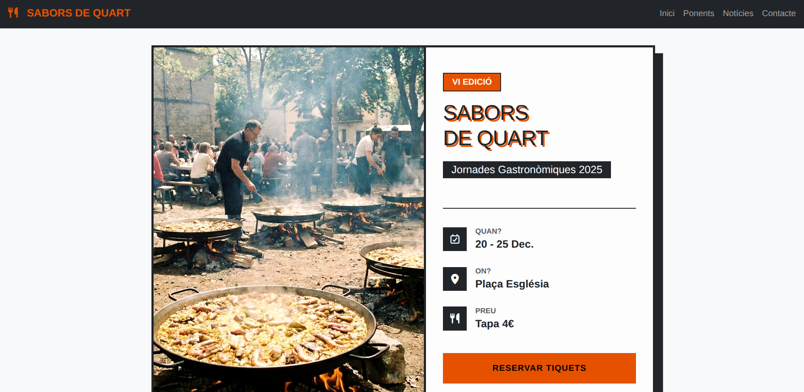
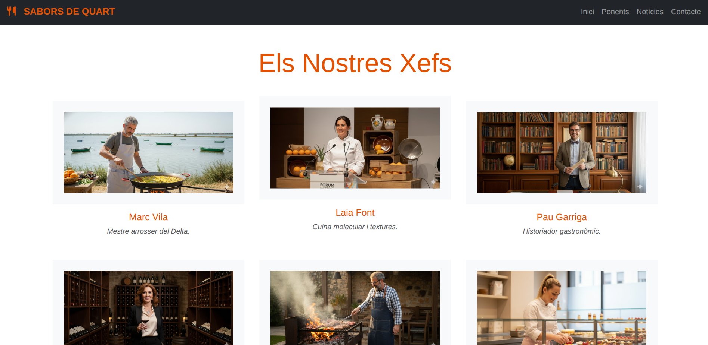
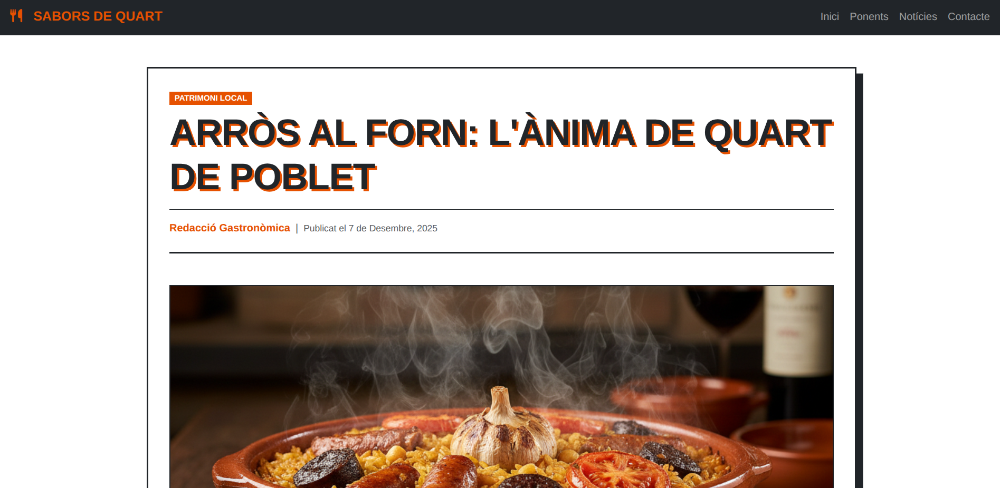
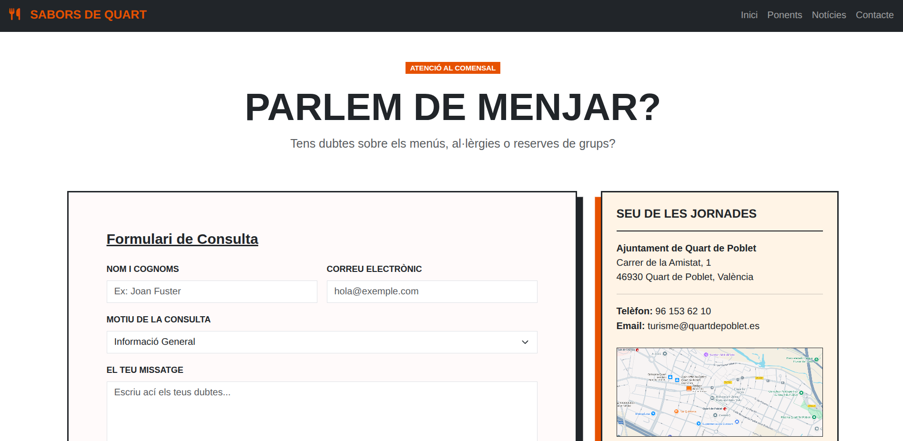

# 🥘 Jornades Gastronòmiques 2025 - Quart de Poblet

> **"El Sabor de la Tradició"**

Aquest projecte és el lloc web oficial i promocional per a les **Jornades Gastronòmiques de l'Arròs al Forn** a Quart de Poblet. Una experiència digital dissenyada per a ressaltar la cultura, la tradició i la innovació culinària local amb una estètica moderna i impactant.


## 🎨 Concepte de Disseny: Neo-Brutalisme Gastronòmic

El disseny s'allunya del minimalisme clàssic per abraçar una estètica **Neo-Brutalista** amb molta personalitat.

### Claus Visuals:
* **Alt Contrast:** Ús predominant de Blanc i Negre (`$color-text`) amb accents vibrants en Taronja (`$primary`).
* **Ombres Sòlides (Hard Shadows):** Elements amb ombres dures desplaçades (sense difuminar) que creen sensació de profunditat tàctil.
* **Tipografia Bold:** Encapçalaments massius en majúscules.
* **Vores Rectes:** Absència de `border-radius` (cantonades rectes) per a una aparença sòlida.
* **Imatges Ultrapanoràmiques:** Ús de ràtios `21x9` amb marcs sòlids per a destacar la fotografia.

## 📂 Estructura del Projecte

L'arquitectura de fitxers segueix l'estructura del **UOC Boilerplate**, organitzada per separar lògica, estils i vistes de manera modular:

```text
uoc-boilerplate/
├── .idea/               # Configuració de l'IDE
├── .parcel-cache/       # Memòria cau del bundler
├── dist/                # Arxius compilats per a producció
├── node_modules/        # Dependències del projecte
├── src/                 # Codi font principal
│   ├── assets/
│   │   ├── fonts/       # Tipografies locals
│   │   ├── images/      # Imatges (s1-s6.png, a1.png, m.png...)
│   │   ├── scripts/
│   │   │   └── main.js  # Punt d'entrada JavaScript
│   │   └── styles/      # Arxius SCSS
│   │       ├── components/
│   │       ├── pages/   # Estils específics (_home.scss...)
│   │       └── main.scss
│   ├── pages/           # Pàgines HTML addicionals (contact, article)
│   ├── views/           # Parcials HTML (header.html, footer.html)
│   └── index.html       # Pàgina principal (Landing)
├── .editorconfig        # Estils de codificació
├── .gitignore
├── .nvmrc               # Versió de Node recomanada
├── .posthtmlrc          # Configuració de PostHTML (includes)
├── .stylelintrc.json    # Regles de linter per a SCSS
├── package.json         # Scripts i dependències
├── package-lock.json
└── README.md            # Documentació
```
## 🚀 Instal·lació i Ús

El projecte utilitza **npm** per a la gestió de paquets i **Parcel** com a empaquetador. Assegura't de tindre [Node.js](https://nodejs.org/) instal·lat.

1.  **Instal·lar dependències:**
    ```bash
    npm install
    ```

2.  **Comandaments disponibles (Scripts):**

    * **Desenvolupament (Dev Server):**
        Neteja la memòria cau i arranca el servidor local al port **8123**.
        ```bash
        npm run dev
        ```
        > *Accedeix a: `http://localhost:8123`*

    * **Producció (Build):**
        Compila i minifica els arxius per a pujar-los al servidor (genera la carpeta `dist` sense mapes de codi).
        ```bash
        npm run build
        ```

    * **Neteja (Clean):**
        Esborra les carpetes `dist`, `.cache`, `.cache-loader` i `.parcel-cache` per si necessites reiniciar l'entorn.
        ```bash
        npm run clean
        ```

    * **Qualitat de Codi (Linting):**
        Revisa que els arxius SCSS complisquen amb les regles d'estil definides.
        ```bash
        npm run stylelint
        ```

## 📖 Pàgines Principals

1.  **Home (Portada):** Disseny tipus pòster amb tipografia gegant, efectes *hover* interactius i crides a l'acció.
2.  **Ponents (Xefs):** Grid de targetes presentant els 6 xefs (`s1` a `s6`) amb imatges personalitzades.
3.  **Blog / Article:** Maquetació editorial per a notícies, amb imatges panoràmiques (`a1`, `a2`), cites destacades i seccions de contingut relacionat.
4.  **Contacte:** Formulari estilitzat i mapa de localització (`m.png`) integrat visualment.

## 📷 Galeria (Previsualització)

| Portada (Hero) | Ponents | Article | Contacte |
| :---: | :---: | :---: | :---: |
|  |  |  | 

## 🔗 Link
https://jornades-gastro.netlify.app/

## ✍️ Autor

Minea Licer Silvestre

